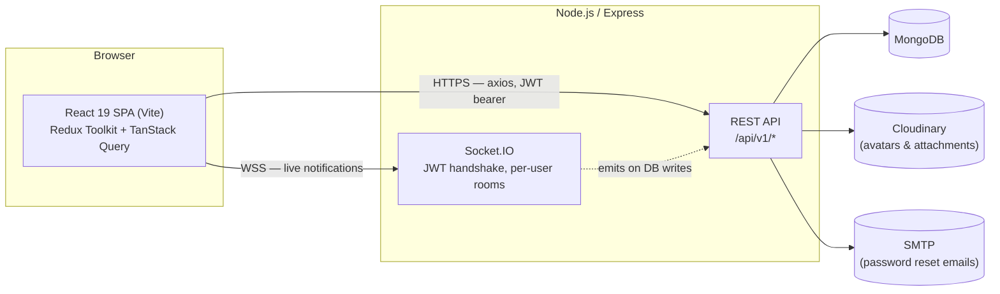
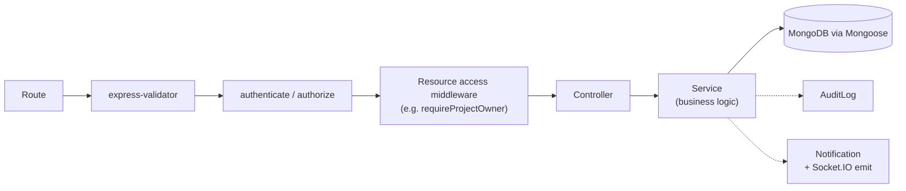
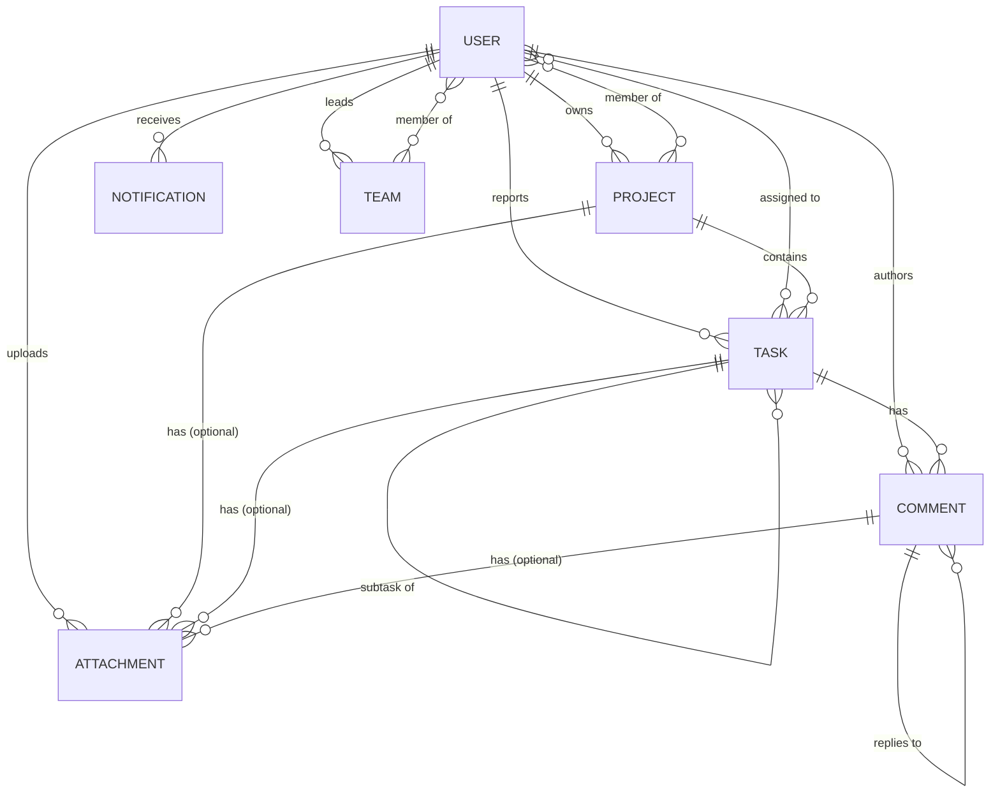

<div align="center">

# Task Manager

**A full-stack project & task management system** — JWT auth with RBAC, real-time
notifications over Socket.IO, Kanban/list/table task views, file attachments via
Cloudinary, an admin panel with system-wide analytics and audit logs, and a
Dockerized dev/prod stack.

[](https://nodejs.org/)
[](https://expressjs.com/)
[](https://www.mongodb.com/)
[](https://react.dev/)
[](https://vitejs.dev/)
[](https://docs.docker.com/compose/)
[](LICENSE)

</div>

---

## Contents

- [Features](#features)
- [Tech stack](#tech-stack)
- [Installation](#installation)
- [Setup](#setup)
- [Environment variables](#environment-variables)
- [Folder structure](#folder-structure)
- [Architecture](#architecture)
- [Database schema](#database-schema)
- [ER diagram](#er-diagram)
- [API documentation](#api-documentation)
- [Deployment](#deployment)
- [Docker](#docker)
- [Screenshots](#screenshots)
- [Testing & quality](#testing--quality)
- [Contributing](#contributing)
- [License](#license)

---

## Features

- **Authentication** — register/login/logout, JWT access + httpOnly refresh-token
  cookie with rotation, forgot/reset password, role-based access control
  (`admin` / `project_manager` / `team_member`).
- **Projects** — CRUD, owner/member management, manager reassignment, progress
  stats, search/filter/pagination, soft delete + restore.
- **Tasks** — CRUD, subtasks, labels, priorities, due dates, assignees, Kanban
  board with drag-and-drop, list and table views, per-task activity history.
- **Comments** — threaded replies, @mentions, edit/delete, per-task feed.
- **Attachments** — drag-and-drop uploads to Cloudinary, type/size validation,
  linked to a task, project, or comment.
- **Notifications** — real-time via Socket.IO (JWT-authenticated, per-user
  rooms), unread badge, dropdown, full history page, toast pop-ups.
- **Dashboard** — role-aware KPI cards and charts (task status, project
  progress, monthly productivity, team performance), activity/notification/
  deadline/comment feeds.
- **Admin panel** — user/role/project/team management, audit log browser,
  system-wide analytics, live system health.
- **Docs & tooling** — Swagger/OpenAPI UI, a generated Postman collection, an
  ER diagram, Dockerized dev and prod stacks, Jest/Vitest test suites with an
  enforced coverage floor.

## Tech stack

| | |
| --- | --- |
| **Frontend** | React 19, Vite, Tailwind CSS, React Router, Redux Toolkit, TanStack Query, React Hook Form, Zod, Axios, Socket.IO client, Framer Motion, Recharts, `@dnd-kit` |
| **Backend** | Node.js, Express, MongoDB, Mongoose, Socket.IO, JWT, bcrypt, Multer, Cloudinary, Nodemailer, express-validator, Winston, Helmet, express-rate-limit |
| **Docs** | Swagger UI (`swagger-jsdoc` + `swagger-ui-express`), a generated Postman collection, Mermaid ER diagram |
| **Testing** | Jest + Supertest (backend), Vitest + Testing Library (frontend) |
| **Infra** | Docker, Docker Compose, nginx (production static serving + reverse proxy) |

## Installation

### Prerequisites

- [Node.js](https://nodejs.org/) 20+ and npm
- [MongoDB](https://www.mongodb.com/try/download/community) running locally, **or**
  a connection string from [MongoDB Atlas](https://www.mongodb.com/atlas) —
  **or** skip both and use [Docker](#docker) instead
- A free [Cloudinary](https://cloudinary.com/) account (for avatar/attachment uploads)
- Optional: SMTP credentials, for password-reset emails to actually send instead
  of just logging to the console in development

### Clone & install

```bash
git clone <this-repository-url> task-manager
cd task-manager

cd backend && npm install
cd ../frontend && npm install
```

## Setup

1. **Backend** — copy the env template and fill in the blanks (see
   [Environment variables](#environment-variables)):

   ```bash
   cd backend
   cp .env.example .env
   npm run dev          # http://localhost:5000
   ```

2. **Frontend** — in a second terminal:

   ```bash
   cd frontend
   cp .env.example .env
   npm run dev           # http://localhost:5173
   ```

3. Open `http://localhost:5173`, register an account, and start using the app.
   The first user you register is a `team_member` — promote it to `admin`
   directly in MongoDB to unlock the admin panel:

   ```js
   // mongosh
   use task_manager
   db.users.updateOne({ email: "you@example.com" }, { $set: { role: "admin" } })
   ```

Prefer not to install Node/MongoDB locally? See [Docker](#docker) — one command
brings up MongoDB, the API, and the frontend together.

## Environment variables

Three separate env files, one per moving part:

### `backend/.env`

| Variable | Default | Notes |
| --- | --- | --- |
| `NODE_ENV` | `development` | `test` disables rate limiting and console log noise |
| `PORT` | `5000` | |
| `API_PREFIX` | `/api/v1` | |
| `CLIENT_URL` | `http://localhost:5173` | CORS origin + Socket.IO origin |
| `MONGODB_URI` | `mongodb://127.0.0.1:27017/task_manager` | |
| `JWT_SECRET` / `JWT_REFRESH_SECRET` | — | **Required.** Long random strings; keep them different from each other |
| `JWT_EXPIRES_IN` | `15m` | Access token lifetime |
| `JWT_REFRESH_EXPIRES_IN` | `7d` | Refresh token / cookie lifetime |
| `BCRYPT_SALT_ROUNDS` | `10` | |
| `CLOUDINARY_CLOUD_NAME` / `CLOUDINARY_API_KEY` / `CLOUDINARY_API_SECRET` | — | **Required** for avatar/attachment uploads |
| `SMTP_HOST` / `SMTP_PORT` / `SMTP_SECURE` / `SMTP_USER` / `SMTP_PASS` | — | Optional — leave blank and password-reset links are logged to the console instead of emailed |
| `EMAIL_FROM` | `Task Manager <no-reply@taskmanager.dev>` | |
| `RESET_PASSWORD_TOKEN_EXPIRES_MINUTES` | `15` | |
| `RATE_LIMIT_WINDOW_MS` / `RATE_LIMIT_MAX` | `900000` / `100` | General API limiter (auth routes have their own, stricter limiter) |
| `LOG_LEVEL` | `info` | Winston log level |

### `frontend/.env`

| Variable | Default | Notes |
| --- | --- | --- |
| `VITE_API_BASE_URL` | `http://localhost:5000/api/v1` | Baked in at build time |
| `VITE_SOCKET_URL` | `http://localhost:5000` | Baked in at build time |

### `.env` (repo root — Docker Compose production only)

| Variable | Default | Notes |
| --- | --- | --- |
| `FRONTEND_PORT` | `8080` | Public port nginx is published on |
| `VITE_API_BASE_URL` / `VITE_SOCKET_URL` | `/api/v1` / `/` | Build args — defaults route through nginx's reverse proxy, see [Docker](#docker) |
| `MONGO_ROOT_USERNAME` / `MONGO_ROOT_PASSWORD` | — | Leave blank to run Mongo without auth; set both to enable it |
| `MONGODB_URI` | `mongodb://mongo:27017/task_manager` | Override if you enabled Mongo auth above |

Every file has a matching `.env.example` — copy it, don't guess the shape.

## Folder structure

```
task-manager/
├── backend/
│   ├── src/
│   │   ├── config/          # env, db, logger, cloudinary, roles, constants
│   │   ├── models/           # Mongoose schemas (User, Project, Task, Comment,
│   │   │                     #   Attachment, Notification, AuditLog, Team)
│   │   ├── controllers/      # thin request handlers
│   │   ├── services/         # business logic, one file per domain
│   │   ├── routes/           # Express routers + @swagger JSDoc
│   │   ├── middleware/       # auth, RBAC, per-resource access, rate limiting,
│   │   │                     #   uploads, error handling
│   │   ├── validators/       # express-validator chains
│   │   ├── utils/            # ApiError, ApiResponse, asyncHandler, JWT, ...
│   │   ├── socket/           # Socket.IO server (JWT handshake, per-user rooms)
│   │   ├── docs/             # swagger.js (OpenAPI spec), ER_DIAGRAM.md
│   │   ├── tests/            # Jest + Supertest suites
│   │   ├── app.js            # Express app (middleware + route mounting)
│   │   └── server.js         # HTTP server + Socket.IO bootstrap
│   ├── docs/                 # API_EXAMPLES.md, generated Postman collection
│   ├── scripts/               # generate-postman.js
│   ├── Dockerfile
│   └── package.json
│
├── frontend/
│   ├── src/
│   │   ├── pages/             # route-level components (+ admin/, auth/)
│   │   ├── layouts/           # MainLayout, AuthLayout, AdminLayout
│   │   ├── components/        # ui/ (generic), + one folder per feature
│   │   │                     #   (projects/, tasks/, dashboard/, admin/, ...)
│   │   ├── hooks/             # TanStack Query hooks, one per resource
│   │   ├── redux/             # store + slices (auth, theme, ui)
│   │   ├── services/          # axios instance, socket client, per-resource API
│   │   ├── validation/        # Zod schemas for forms
│   │   ├── utils/             # formatters, chart theme, misc helpers
│   │   └── tests/             # Vitest + Testing Library suites
│   ├── Dockerfile
│   ├── nginx.conf             # production reverse proxy config
│   └── package.json
├── docker-compose.yml          # development stack
├── docker-compose.prod.yml     # production stack
├── .env.example                 # Compose-level vars (production only)
├── CONTRIBUTING.md
└── LICENSE
```

## Architecture



**Backend** follows a conventional layered request flow — routes stay thin,
business logic lives in services, controllers just glue the two together:



**Frontend** keeps server state and client state deliberately separate:
TanStack Query owns anything that comes from the API (with optimistic updates
on mutations), while Redux only holds cross-cutting client state — the
authenticated user/token, theme, and toast queue. Real-time events from
Socket.IO patch directly into the TanStack Query cache, so a live update looks
identical to a normal refetch to the rest of the app.

## Database schema

MongoDB via Mongoose, 8 collections. Every collection uses the shared
`softDeletePlugin` (`isDeleted`/`deletedAt` + query-level filtering) — see
[ER diagram](#er-diagram) for the full field list and indexing strategy.

| Model | Purpose | Key relationships |
| --- | --- | --- |
| **User** | Accounts, auth, RBAC | Owns/reports/authors/uploads most other collections |
| **Project** | Top-level container for work | `owner` (User), `members` (User[]) |
| **Task** | Unit of work inside a project | `project`, `reporter` (User), `assignees` (User[]), `parentTask` (self, for subtasks) |
| **Comment** | Discussion on a task | `task`, `author` (User), `parentComment` (self, for threads), `mentions` (User[]) |
| **Attachment** | Uploaded file | Exactly one of `task` / `project` / `comment`, plus `uploadedBy` (User) |
| **Notification** | In-app alert | `recipient`/`sender` (User), polymorphic `entityType`+`entityId` |
| **AuditLog** | Immutable action history | `user` (User, nullable for system actions), polymorphic `entityType`+`entityId` |
| **Team** | Admin-managed grouping of users | `lead` (User), `members` (User[]) |

## ER diagram

Full version (with every field, plus the indexing strategy and soft-delete
mechanics) lives in
[`backend/src/docs/ER_DIAGRAM.md`](backend/src/docs/ER_DIAGRAM.md). Summary:



## API documentation

Three complementary layers, all generated from the same JSDoc annotations in
`backend/src/routes/*.js` so they can't drift apart:

1. **Swagger UI** — interactive, try-it-out docs at `http://localhost:5000/api-docs`
   once the backend is running. Every endpoint, request/response schema, and
   error case (401/403/404/409/422) is documented with real examples.
2. **Postman collection** — `backend/docs/postman/TaskManager.postman_collection.json`
   (+ a matching `.postman_environment.json`). 60 requests across 10 folders,
   with example bodies, saved example responses, and a test script on
   Login/Register that auto-captures the access token into a collection
   variable so every other request just works after one login. Regenerate it
   after changing a route's docs with:

   ```bash
   cd backend && npm run docs:postman
   ```

3. **`backend/docs/API_EXAMPLES.md`** — copy-pasteable curl walkthroughs of the
   full auth flow, a catalog of every error shape the API returns, and a
   representative example per resource.

Health check: `GET /health` (unprefixed, no auth).

## Deployment

The [Docker](#docker) production compose file is the simplest path if you
have a server to run it on — it builds both images, wires up nginx, and
needs nothing else installed on the host. If you'd rather use managed
platforms instead, see
[`DEPLOY_RENDER_VERCEL.md`](DEPLOY_RENDER_VERCEL.md) for deploying the
backend on Render, the frontend on Vercel, and the database on MongoDB
Atlas. A few things to get right regardless of how you deploy:

- **Secrets**: generate fresh, long `JWT_SECRET`/`JWT_REFRESH_SECRET` values —
  never reuse the ones from `.env.example`. Set real Cloudinary credentials.
- **Database**: either the bundled MongoDB container/volume, or point
  `MONGODB_URI` at a managed instance (e.g. [MongoDB Atlas](https://www.mongodb.com/atlas))
  for durability/backups you don't have to run yourself.
- **`CLIENT_URL`**: must match the origin the frontend is actually served from
  — it's both the CORS allow-list entry and the Socket.IO origin check.
- **TLS**: terminate HTTPS in front of nginx (a managed load balancer, or
  [Caddy](https://caddyserver.com/)/[Traefik](https://traefik.io/) instead of
  nginx if you'd rather have automatic certificates) — nothing in this repo
  handles TLS itself.
- **Frontend build-time vars**: `VITE_API_BASE_URL`/`VITE_SOCKET_URL` are
  compiled into the JS bundle, not read at runtime — changing them means
  rebuilding the frontend image/bundle, not just restarting a container.
- **Horizontal scaling**: if you run more than one backend instance behind a
  load balancer, Socket.IO needs a shared adapter (e.g.
  [`socket.io-redis`](https://github.com/socketio/socket.io-redis-adapter)) so
  real-time events reach a client connected to a different instance — the
  current setup assumes a single backend instance.
- **CI**: there's no CI pipeline in this repo yet — `npm run lint && npm test`
  in both `backend/` and `frontend/` is what any pipeline you add should run;
  see [Testing & quality](#testing--quality) for current coverage.

## Docker

The whole stack (MongoDB + backend + frontend) runs via Docker Compose, in
either a hot-reloading development mode or a production mode built from
immutable images.

### Development mode

Hot-reloading: nodemon on the backend, Vite's dev server (with HMR) on the
frontend, both bind-mounted from source so local edits apply instantly.

```bash
cp backend/.env.example backend/.env    # fill in Mongo URI, JWT secrets, Cloudinary keys
cp frontend/.env.example frontend/.env
docker compose up --build
```

| Service | URL |
| --- | --- |
| Frontend | http://localhost:5173 |
| API | http://localhost:5000/api/v1 |
| API docs | http://localhost:5000/api-docs |
| Health check | http://localhost:5000/health |
| MongoDB | mongodb://localhost:27017 |

### Production mode

Builds optimized, non-root images: the backend runs as a plain Node process,
and the frontend is a static bundle served by nginx, which also reverse-proxies
`/api` and `/socket.io` to the backend so the browser only ever talks to one
origin.

```bash
cp backend/.env.example backend/.env    # real secrets — never commit this file
cp .env.example .env                    # compose-level knobs: port, Mongo credentials
docker compose -f docker-compose.prod.yml up --build -d
```

The app is served at `http://localhost:${FRONTEND_PORT:-8080}`. See
[Environment variables](#environment-variables) for the available
compose-level knobs.

Both compose files define container health checks (`/health` for the backend,
`/` for mongo/frontend) and named volumes for MongoDB data, backend logs, and —
in development only — each service's `node_modules`, so host-installed native
modules never clash with the container's Linux-built ones.

> **Note:** `mongo:7` requires a CPU with AVX support. On older hardware or a VM
> without AVX passthrough, the `mongo` container will exit immediately — pin
> `image:` to an older tag (e.g. `mongo:4.4`) in that case.

## Screenshots

Not committed yet.

## Testing & quality

| | Backend | Frontend |
| --- | --- | --- |
| Framework | Jest + Supertest | Vitest + Testing Library |
| Run | `npm test` | `npm run test` |
| Coverage | `npm run test:coverage` (80% floor enforced on statements/branches/functions/lines — see `jest.config.js`) | — |
| Lint | `npm run lint` (ESLint) | `npm run lint` (oxlint) |
| Current | 161 tests / 17 suites, ~97% statements, 83% branches | 44 tests / 18 suites |

Backend tests spin up a real in-memory MongoDB (`mongodb-memory-server`) per
suite — no external database needed to run them.

## Contributing

Bug reports, feature requests, and PRs are welcome — see
[CONTRIBUTING.md](CONTRIBUTING.md) for branch naming, commit conventions, and
the pre-PR checklist (lint + tests + docs updates).

## License

[MIT](LICENSE) — do what you want with it, just keep the copyright notice.
