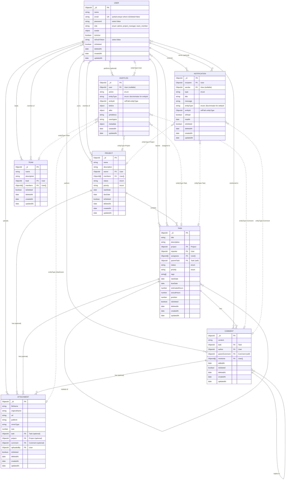

# Entity-Relationship Diagram

Data model for the Project & Task Management System. Source of truth for schema shape lives in `backend/src/models/`.

## Relationship notes

- **User ↔ Project**: a user `owns` zero or more projects (`Project.owner`); a user can also be a `member` of many projects and a project has many members (`Project.members`, many-to-many).
- **User ↔ Task**: a user `reports` (creates) many tasks (`Task.reporter`); a user can be `assigned` to many tasks and a task can have many assignees (`Task.assignees`, many-to-many).
- **Project → Task**: one project contains many tasks (`Task.project`), cascade scope for board/list views.
- **Task → Task**: a task may have a `parentTask` (self-referencing, one level of subtasks).
- **Task → Comment**: one task has many comments (`Comment.task`); comments can thread via `Comment.parentComment` (self-referencing).
- **Comment → Attachment / Task → Attachment / Project → Attachment**: `Attachment` is optionally linked to exactly one (or more) of `task`, `project`, `comment` — enforced by a `pre('validate')` hook requiring at least one parent reference.
- **AuditLog**: polymorphic pointer (`entityType` + `entityId` via Mongoose `refPath`) to any of `User`, `Project`, `Task`, `Comment`, `Attachment`, `Team`. Immutable history of who did what to which entity.
- **Notification**: polymorphic pointer (same `refPath` pattern) to the `Project`/`Task`/`Comment` that triggered it, addressed to a `recipient` and optionally raised by a `sender`.
- **User ↔ Team**: a user `leads` zero or more teams (`Team.lead`); a user can also be a `member` of many teams and a team has many members (`Team.members`, many-to-many). Teams are an admin-managed grouping of users and are not otherwise linked to `Project`/`Task` records.

## Soft delete

Every model applies the shared `softDeletePlugin` (`backend/src/models/plugins/softDelete.js`):

- Adds `isDeleted` (default `false`) and `deletedAt` (default `null`).
- `pre` hooks on `find`, `findOne`, `findOneAndUpdate`, `findOneAndDelete`, `findOneAndReplace`, `countDocuments` transparently exclude soft-deleted documents unless the query opts in.
- `doc.softDelete()` / `doc.restore()` instance methods.
- `Model.find().withDeleted()` — bypass the filter (includes deleted + active).
- `Model.find().onlyDeleted()` — return only soft-deleted documents.
- `User.email` uses a **partial unique index** (`{ isDeleted: false }`) so a new account can reuse an email address once the previous holder has been soft-deleted.

## Indexing strategy (write-optimized)

Indexes are chosen to match expected read patterns rather than indexing every field, since each index has a write-side cost:

| Model | Index | Serves |
| --- | --- | --- |
| User | `{ email: 1 }` unique partial | login/lookup, allows email reuse after soft delete |
| User | `{ role: 1, isDeleted: 1 }` | role-based user listing |
| Project | `{ owner: 1, isDeleted: 1 }`, `{ members: 1 }` | "my projects" / "projects I'm a member of" |
| Project | `{ status: 1, dueDate: 1 }` | dashboard filters, upcoming deadlines |
| Project | text index on `name`, `description` | search |
| Task | `{ project: 1, status: 1 }`, `{ project: 1, position: 1 }` | kanban board per project |
| Task | `{ assignees: 1 }`, `{ reporter: 1 }`, `{ parentTask: 1 }`, `{ dueDate: 1 }` | "my tasks", subtasks, due-soon queries |
| Task | text index on `title`, `description` | search |
| Comment | `{ task: 1, createdAt: -1 }` | comment thread for a task, newest/oldest ordering |
| Attachment | `{ task: 1, createdAt: -1 }`, `{ project: 1, createdAt: -1 }` | file list per task/project |
| AuditLog | `{ entityType: 1, entityId: 1, createdAt: -1 }` | history for a specific record |
| AuditLog | `{ user: 1, createdAt: -1 }` | activity feed for a user |
| Notification | `{ recipient: 1, isRead: 1, createdAt: -1 }`, `{ recipient: 1, createdAt: -1 }` | unread notifications inbox, full history |
| Notification | `{ entityType: 1, entityId: 1 }` | lookups by the entity that triggered the notification |
| Team | `{ lead: 1, isDeleted: 1 }`, `{ members: 1 }` | "teams I lead" / "teams I'm a member of" |
| Team | text index on `name`, `description` | search |
